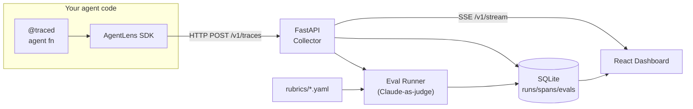

# AgentLens

> Self-hosted observability + LLM-as-judge eval dashboard for multi-agent runs: live traces, call trees, tool I/O, and inline rubric scoring.

<!-- TODO: replace with a 5-10 second demo gif. Record with ScreenToGif on
     Windows or peek on macOS. Save to docs/demo.gif and update path here. -->


## What it is

AgentLens makes multi-agent systems observable and evaluable without sending data to a third party. Wrap agent functions with a `@traced` decorator and every LLM call, tool invocation, agent handoff, and retry becomes a structured span. A React dashboard renders runs as an interactive Gantt timeline and hierarchical call tree, with per-span panels showing the exact prompt, output, tool call JSON, token counts, and latency.

On top of raw tracing, AgentLens ships a rubric-based eval harness. Define YAML rubrics describing what a good run looks like — "did the agent cite its sources?", "did it avoid redundant tool calls?" — and AgentLens runs Claude-as-judge against each completed trace. Pass/fail results with the judge's reasoning appear inline next to the trace that produced them.

## Quickstart

```bash
git clone https://github.com/RitikPatill/agent-lens.git
cd agent-lens

# Install Python packages (requires Python 3.11+) and Node modules
py -3.11 -m pip install -e "sdk/[dev]"
py -3.11 -m pip install -e "server/[dev]"
cd dashboard && npm install && cd ..

# Set your API key, then start everything and run the built-in demo
export ANTHROPIC_API_KEY=sk-ant-...
make demo
# Open http://localhost:5173
```

`make demo` starts the FastAPI collector on port 8000 and the Vite dashboard on port 5173, runs `examples/research_assistant.py`, then keeps both services alive. Press Ctrl-C to stop.

## Usage

After `make demo` the dashboard opens at `http://localhost:5173`. The demo run (a Planner → Researcher → Writer pipeline answering a research question) appears at the top of the run list with status `running` and spans streaming in live. Click the run to see the full call tree: the Planner spawning two parallel Researcher sub-agents, each making tool calls, then the Writer composing the final answer. Expand any span to inspect its prompt, response, and metadata.

The **Eval** panel fills in roughly 30 seconds after completion with rubric scores: each rubric shows PASS or FAIL, and hovering shows the judge's reasoning.

To instrument your own code:

```python
from agentlens import configure, traced, span
from agentlens.anthropic_wrap import TracedAsyncAnthropic

configure(endpoint="http://localhost:8000")
client = TracedAsyncAnthropic()  # drop-in for anthropic.AsyncAnthropic()

@traced
async def research(query: str) -> str:
    async with span("fetch-context"):
        ...  # retrieve documents

    response = await client.messages.create(
        model="claude-opus-4-6",
        max_tokens=1024,
        messages=[{"role": "user", "content": query}],
    )
    return response.content[0].text
```

`TracedAsyncAnthropic` automatically captures model name, prompt, completion, and token counts without any extra code.

## Architecture



The SDK sends trace events to the FastAPI collector over HTTP. The collector persists them to SQLite, fans events out to the dashboard via Server-Sent Events, and triggers a background eval task when a run completes. See [docs/ARCHITECTURE.md](docs/ARCHITECTURE.md) for a full layer-by-layer breakdown.

## Project structure

```
agent-lens/
├── sdk/             # agentlens Python package — @traced, span(), TracedAnthropic
├── server/          # FastAPI collector — /v1/traces ingest, SSE stream, eval runner
├── dashboard/       # React/Vite SPA — run list, Gantt, call tree, span inspector
├── examples/        # research_assistant.py — Planner → Researcher → Writer demo
├── rubrics/         # YAML rubric definitions for Claude-as-judge eval
├── scripts/         # record_demo.sh — orchestrates make demo
└── docs/            # ARCHITECTURE.md, ROADMAP.md, demo.gif
```

## Roadmap

- [ ] OpenTelemetry-compatible trace export (OTLP) so spans can be forwarded to Jaeger or Tempo
- [ ] Token cost rollups per run and per model, with configurable price tables
- [ ] Eval result diffing across runs to track regressions when prompts change
- [ ] Auth layer (API key + session) for teams sharing a single collector instance
- [ ] `pip install agentlens` release to PyPI with a one-command server start

## License

MIT — see [LICENSE](LICENSE).

---

Built autonomously by [autodev](https://github.com/RitikPatill/autodev),
a multi-agent orchestrator I designed. Each commit in this repo was
authored by me; the implementation work was performed by Sonnet under
the orchestrator's control. Read the orchestrator's README to see how.
