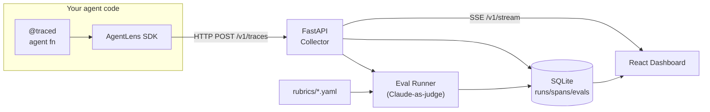

# AgentLens

**Make your multi-agent systems observable and evaluable.**

<!-- TODO: replace with actual demo GIF after M8 -->


AgentLens is a self-hosted dashboard that turns chaotic agent runs into structured, inspectable traces — with a built-in rubric eval harness powered by Claude-as-judge. Framework-agnostic, local-first, no cloud required.

> **M5 shipped.** Call-tree + span inspector are live. Click any span in the Gantt or tree to open the inspector (Input / Output / Metadata / Raw tabs). M6 (rubric evals) comes next.

---

## What works now

### M1 — Scaffold
- Monorepo layout: `sdk/`, `server/`, `dashboard/`, `examples/`, `rubrics/`, `docs/`
- Python toolchain: root `pyproject.toml` with ruff (lint + format) and mypy; per-package `pyproject.toml` under `sdk/` and `server/`
- Node toolchain: `dashboard/package.json` with ESLint, Prettier, Tailwind CSS, Vite, and TypeScript
- Pre-commit config (`.pre-commit-config.yaml`) wiring ruff and ESLint hooks
- `Makefile` with `install`, `lint`, `format`, and `test` targets (all functional); `dev` and `demo` stubbed for later milestones
- `docker-compose.yml` and `server/Dockerfile` skeleton
- MIT license, `.gitignore` covering Python and Node artifacts

### M2 — Trace schema + Python SDK
- **Pydantic v2 trace models** — `Run`, `Span`, `SpanKind` (`llm`, `tool`, `agent`, `memory`, `retry`), `RunStatus`, and `TraceEvent`; all serialisable to JSON
- **`TraceClient`** — module-level `configure()` sets the collector endpoint; `_emit` swallows transport errors via `warnings.warn` so instrumentation never crashes user code
- **`@traced` decorator** — works on sync and async functions; opens a root span, propagates `run_id` / `span_id` via `contextvars`, and records duration + exceptions
- **`span()` / `async_span()` context managers** — create child spans inside any traced function; nesting is tracked automatically
- **`TracedAnthropic` / `TracedAsyncAnthropic`** — thin wrappers around the Anthropic SDK that capture model name, prompt messages, completion text, and token counts as `llm`-kind spans; import is guarded so `anthropic` remains an optional dependency
- Unit tests covering models, decorator behaviour (sync + async), span nesting, context propagation, and the Anthropic wrapper

### M3 — FastAPI collector + SQLite storage
- **`POST /v1/traces`** — batch-ingest endpoint accepts a `TraceEvent` list; writes runs and spans to SQLite in a single transaction
- **`GET /v1/runs`** — returns all runs ordered by start time, with status and token-count summaries
- **`GET /v1/runs/{id}/spans`** — returns every span for a run, preserving parent–child relationships
- **`GET /v1/stream`** — SSE endpoint; each new span is fanned out in real time to all connected subscribers via `SSEBroadcaster` (per-subscriber `asyncio.Queue`)
- **SQLite schema** — async SQLAlchemy engine; `runs` and `spans` tables with indexes on `run_id` and `parent_span_id` for fast tree queries
- **CORS** — `allow_origins=["*"]` for local dashboard development
- **Integration tests** — 9 tests run the SDK against a live in-process collector; cover ingest, retrieval, and SSE delivery

### M4 — Dashboard: run list + live timeline
- **Run list page (`/`)** — table of all runs with status badge, name, started-at (relative time), duration, model, and token count; rows link to run detail
- **Run detail page (`/runs/:runId`)** — Gantt-style timeline of spans, color-coded by kind (`llm`=blue, `tool`=orange, `agent`=purple, `memory`=green, `retry`=red); hover tooltip shows name, kind, duration, and token counts
- **Live SSE tailing** — running runs stream new spans in without a page refresh; Gantt bars grow in real time via 1-second tick
- **Status badges** — green/amber (pulsing)/red for completed/running/failed
- **Deep-links** — `/runs/:runId` URLs work directly; Vite dev server proxies `/v1/*` to `http://localhost:8000`
- **7 unit tests** — `api.test.ts` covers fetch wrappers; `GanttChart.test.tsx` covers span rendering, running-span animation, and bar sizing


### M5 — Dashboard: call tree + span inspector
- **Collapsible call tree** — right-hand panel in run detail; spans rendered as an indented hierarchy derived from `parent_span_id`; root nodes start expanded, deeper nodes start collapsed; kind-colored dots + duration for each node
- **Span inspector** — opens below the timeline when a span is clicked (in either the Gantt or the tree); four tabs: **Input** (markdown), **Output** (markdown), **Metadata** (latency, model, per-span and subtree token counts), **Raw** (pretty JSON of attributes); closeable with `×`
- **Clickable Gantt bars** — clicking a bar or label selects that span and highlights it with a white ring
- **`src/lib/tree.ts`** — pure helpers `buildChildMap` / `getSubtreeIds` for tree construction and subtree token rollups
- **24 unit tests across 5 files** — `tree.test.ts`, `CallTree.test.tsx`, `SpanInspector.test.tsx` (all new) plus existing `GanttChart.test.tsx` and `api.test.ts`

---

## Planned features

- **Rubric evals** — define YAML rubrics, run Claude-as-judge against completed traces, get pass/fail + reasoning surfaced next to the trace — M6 (next)
- **Framework-agnostic** — works with raw Anthropic SDK, LangGraph, or any custom orchestrator
- **Local-first** — SQLite persistence, single `docker compose up`, no cloud accounts

---

## Architecture



---

## Quickstart

Install dependencies and run the test suite:

```bash
make install   # installs Python packages (uv) + Node modules
make lint      # ruff + eslint
make test      # pytest: sdk/tests/ + server/tests/
```

Install pre-commit hooks:

```bash
pre-commit install
```

Start the dashboard (dev mode, proxies `/v1/*` to `localhost:8000`):

```bash
cd dashboard
npm install
npm run dev      # → http://localhost:5173
npm test         # run 24 unit tests
```

Instrument your agent code with the SDK:

```python
from agentlens import configure, traced, span
from agentlens.anthropic_wrap import TracedAnthropic

configure(endpoint="http://localhost:8000")  # start the collector first: cd server && uvicorn agentlens_server.main:app

client = TracedAnthropic()  # drop-in for anthropic.Anthropic()

@traced
async def research(query: str) -> str:
    async with span("fetch-context"):
        # ... retrieve documents ...
        pass

    response = await client.messages.create(
        model="claude-opus-4-6",
        max_tokens=1024,
        messages=[{"role": "user", "content": query}],
    )
    return response.content[0].text
```

> **`make dev` and the demo script are not yet wired up.** `make dev` will become a single-command launcher in a later milestone; the demo script lands in M7. The full one-liner below is the M7+ target:
>
> ```bash
> # M7+ target — not functional yet
> docker compose --profile full up
> python examples/research_assistant.py "How did SpaceX land Starship?"
> ```

---

## Project layout

```
agent-lens/
├── sdk/                        # agentlens Python package (pip install agentlens)
│   ├── agentlens/
│   │   ├── models.py           # Pydantic v2: Run, Span, SpanKind, TraceEvent
│   │   ├── context.py          # contextvars: run_id / span_id propagation
│   │   ├── client.py           # TraceClient, configure()
│   │   ├── decorators.py       # @traced, span(), async_span()
│   │   └── anthropic_wrap.py   # TracedAnthropic / TracedAsyncAnthropic
│   └── tests/
├── server/                     # FastAPI collector + SQLite storage
│   ├── agentlens_server/
│   │   ├── main.py             # FastAPI app: /v1/traces, /v1/runs, /v1/stream
│   │   ├── db.py               # SQLAlchemy async engine, runs/spans schema
│   │   └── sse.py              # SSEBroadcaster fan-out
│   └── tests/                  # 9 integration tests
├── dashboard/                  # React/Vite SPA (M5 complete)
│   ├── src/
│   │   ├── types.ts            # TypeScript interfaces: Run, Span, TraceEvent, KIND_COLORS
│   │   ├── api.ts              # Typed fetch wrappers: getRuns(), getSpans()
│   │   ├── hooks/useSSE.ts     # SSE hook with auto-reconnect
│   │   ├── pages/RunList.tsx   # Run table with live SSE updates
│   │   ├── pages/RunDetail.tsx # Gantt + call tree + span inspector
│   │   ├── components/
│   │   │   ├── StatusBadge.tsx    # Status pill (running/completed/failed)
│   │   │   ├── GanttChart.tsx     # CSS proportional Gantt with hover tooltips
│   │   │   ├── CallTree.tsx       # Collapsible span hierarchy tree
│   │   │   └── SpanInspector.tsx  # 4-tab per-span detail pane
│   │   ├── lib/tree.ts         # buildChildMap, getSubtreeIds helpers
│   │   └── __tests__/          # 24 vitest unit tests
├── examples/                   # Demo agents (M7)
├── rubrics/                    # YAML eval rubric definitions (M6)
└── docs/                       # Screenshots, GIF, architecture diagrams
```

---

## Milestones

| # | Name | Status |
|---|------|--------|
| M1 | Scaffold + README | done |
| M2 | Trace schema + Python SDK | done |
| M3 | FastAPI collector + SQLite schema | done |
| M4 | Dashboard run list + Gantt timeline | done |
| M5 | Span call-tree + per-span inspector | done |
| M6 | Eval harness + rubric runner | planned |
| M7 | Demo agent (research assistant) | planned |
| M8 | Polish + demo GIF + docs | planned |

---

## Development

```bash
# Install all deps
make install

# Lint
make lint

# Format
make format

# Test
make test
```

Install pre-commit hooks (optional but recommended):

```bash
pre-commit install
```

---

## License

MIT — see [LICENSE](LICENSE).
