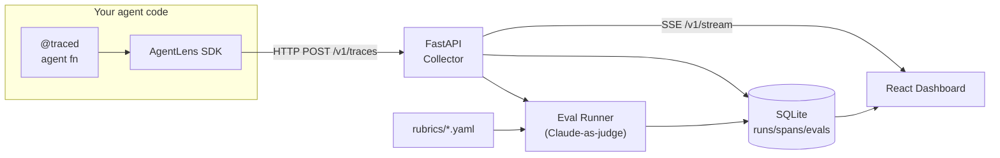

# AgentLens

**Make your multi-agent systems observable and evaluable.**

<!-- TODO: replace with actual demo GIF after M8 -->


AgentLens is a self-hosted dashboard that turns chaotic agent runs into structured, inspectable traces — with a built-in rubric eval harness powered by Claude-as-judge. Framework-agnostic, local-first, no cloud required.

> **M1 shipped.** The repo scaffold, tooling configuration, and stub packages are in place. Feature implementation begins in M2.

---

## What ships in M1

- Monorepo layout: `sdk/`, `server/`, `dashboard/`, `examples/`, `rubrics/`, `docs/`
- Python toolchain: root `pyproject.toml` with ruff (lint + format) and mypy; per-package `pyproject.toml` under `sdk/` and `server/`
- Node toolchain: `dashboard/package.json` with ESLint, Prettier, Tailwind CSS, Vite, and TypeScript
- Pre-commit config (`.pre-commit-config.yaml`) wiring ruff and ESLint hooks
- `Makefile` with `install`, `lint`, `format`, and `test` targets (all functional); `dev` and `demo` stubbed for later milestones
- Stub Python packages: `agentlens` (SDK, empty) and `agentlens_server` (FastAPI app with a `/health` endpoint), each with placeholder test suites
- `docker-compose.yml` and `server/Dockerfile` skeleton
- MIT license, `.gitignore` covering Python and Node artifacts

---

## Planned features

- **Structured tracing** — `@traced` decorator + context-managed spans capture every LLM call, tool invocation, agent handoff, memory read/write, and retry
- **Live dashboard** — React SPA with Gantt-style timeline, hierarchical call tree, and per-span inspector (prompts, outputs, tool args, token counts, latency)
- **Rubric evals** — define YAML rubrics, run Claude-as-judge against completed traces, get pass/fail + reasoning surfaced next to the trace
- **Framework-agnostic** — works with raw Anthropic SDK, LangGraph, or any custom orchestrator
- **Local-first** — SQLite persistence, single `docker compose up`, no cloud accounts

---

## Architecture



---

## Quickstart

Install dependencies and verify the scaffold:

```bash
make install   # installs Python packages (uv) + Node modules
make lint      # ruff + eslint
make test      # pytest: sdk/tests/ + server/tests/
```

Install pre-commit hooks:

```bash
pre-commit install
```

> **Docker, `make dev`, and the demo script are not yet wired up.** They land in M3 (server), M4 (dashboard), and M7 (demo agent) respectively. The full one-liner below is the M7+ target:
>
> ```bash
> # M7+ target — not functional in M1
> docker compose --profile full up
> python examples/research_assistant.py "How did SpaceX land Starship?"
> ```

---

## Project layout

```
agent-lens/
├── sdk/                  # agentlens Python package (pip install agentlens)
├── server/               # FastAPI collector + eval runner
├── dashboard/            # React/Vite SPA
├── examples/             # Demo agents (research_assistant.py, …)
├── rubrics/              # YAML eval rubric definitions
└── docs/                 # Screenshots, GIF, architecture diagrams
```

---

## Milestones

| # | Name | Status |
|---|------|--------|
| M1 | Scaffold + README | ✅ done |
| M2 | SDK core (`@traced`, `TraceClient`) | ⬜ planned |
| M3 | FastAPI collector + SQLite schema | ⬜ planned |
| M4 | Dashboard run list + span tree | ⬜ planned |
| M5 | Timeline (Gantt) view | ⬜ planned |
| M6 | Eval harness + rubric runner | ⬜ planned |
| M7 | Demo agent (research assistant) | ⬜ planned |
| M8 | Polish + demo GIF + docs | ⬜ planned |

---

## Development

```bash
# Install all deps
make install

# Lint
make lint

# Format
make format

# Test
make test
```

Install pre-commit hooks (optional but recommended):

```bash
pre-commit install
```

---

## License

MIT — see [LICENSE](LICENSE).
