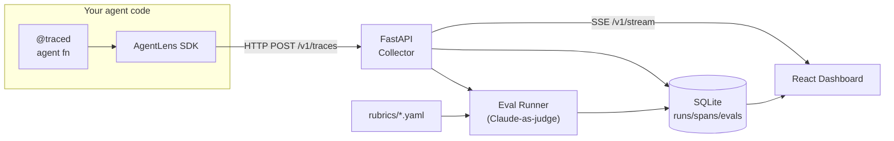
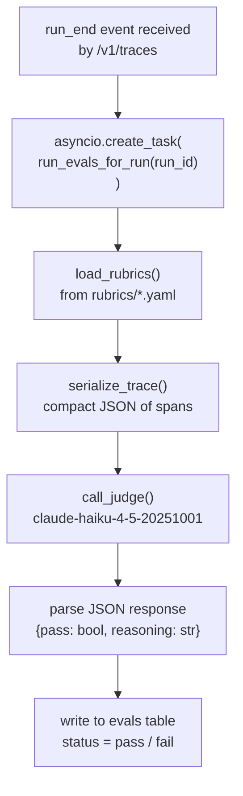

# AgentLens Architecture

A deep-dive into the internals of each layer. For a quickstart, see the [README](../README.md).

---

## Overview

AgentLens splits into four components that communicate over HTTP and SQLite:

1. **Python SDK** (`sdk/`) — lightweight instrumentation library; sends trace events to the collector.
2. **FastAPI Collector** (`server/`) — ingests events, persists them, streams live updates, and runs evals.
3. **React Dashboard** (`dashboard/`) — renders runs, Gantt timelines, call trees, and eval results.
4. **Eval Harness** — YAML rubric definitions + Claude-as-judge runner baked into the collector.

---

## Data flow



Async eval pipeline detail:



---

## Python SDK (`sdk/`)

**Key files:** `models.py`, `context.py`, `client.py`, `decorators.py`, `anthropic_wrap.py`

### Context propagation

`context.py` uses Python `contextvars` for async-safe `run_id` and `span_id` propagation. Each async task inherits the context of its creator, so parallel sub-agents automatically get the correct parent span without any manual wiring.

```python
_run_id_var: ContextVar[Optional[str]] = ContextVar("run_id", default=None)
_span_id_var: ContextVar[Optional[str]] = ContextVar("span_id", default=None)
```

Every set returns a `Token` that is reset in a `finally` block, preventing context leaks across calls.

### `@traced` lifecycle

1. Generate `run_id` (UUID) if no run is active; otherwise reuse the existing run.
2. Generate `span_id`; record `start_time`.
3. Set context vars; call the wrapped function.
4. On return or exception: record `end_time`, mark status, emit a `span_end` + (if root) `run_end` event.
5. Reset context vars via token.

`span()` / `async_span()` context managers follow the same pattern but always create child spans under the current `span_id`.

### `TraceClient._emit`

Fire-and-forget HTTP POST to `/v1/traces`. Errors are swallowed via `warnings.warn` so instrumentation **never crashes user code** — a deliberate design choice for production safety.

### `TracedAnthropic` / `TracedAsyncAnthropic`

Thin wrappers in `anthropic_wrap.py` that override `messages.create` to open an `llm`-kind span, call the real Anthropic client, then record the model name, input messages, output text, and token counts in span attributes. The `anthropic` package is an optional dependency; its absence raises `ImportError` with a helpful message.

---

## FastAPI Collector (`server/`)

**Key files:** `main.py`, `db.py`, `sse.py`, `eval_runner.py`

### `/v1/traces` — batch ingest

Accepts a list of `TraceEvent` objects (Pydantic-validated). Each event is either `run_start`, `run_end`, `span_start`, or `span_end`. Events are written to SQLite in a single async transaction. On `run_end`, an eval task is created: `asyncio.create_task(run_evals_for_run(run_id))`.

Every event is also published to the SSE broadcaster so connected dashboards see it immediately.

### SSE fan-out (`sse.py`)

`SSEBroadcaster` maintains a `list[asyncio.Queue]`. Each `/v1/stream` subscriber gets its own queue. `broadcast(event)` puts the event on all queues. Disconnected clients are cleaned up lazily when their queue raises a disconnect.

### SQLite async engine (`db.py`)

Engine is `None` at import time and created inside `init_db()`, which reads the `DATABASE_URL` environment variable. This makes the module testable: tests monkeypatch `db_module.engine` and `db_module.AsyncSessionLocal` before calling any endpoint.

Key indexes: `run_id` on `spans`, `parent_span_id` on `spans` for fast tree queries.

### Eval runner (`eval_runner.py`)

1. `load_rubrics()` — scans `rubrics/*.yaml`, skips `enabled: false`.
2. `serialize_trace(run_id)` — loads all spans for the run, serializes to compact JSON (name, kind, attributes only).
3. `call_judge(rubric, trace_json)` — fills `{trace_json}` placeholder in `judge_prompt`, calls `claude-haiku-4-5-20251001`, parses `{"pass": bool, "reasoning": "..."}`.
4. Results written to `evals` table; dashboard polls `/v1/runs/{id}/evals` every 3s.

---

## React Dashboard (`dashboard/`)

**Key files:** `api.ts`, `hooks/useSSE.ts`, `lib/tree.ts`, `pages/RunList.tsx`, `pages/RunDetail.tsx`, `components/*`

### Vite proxy

In development, `vite.config.ts` proxies `/v1/*` → `http://localhost:8000`. In production, the SPA is served by the same FastAPI process (or a reverse proxy), so relative URLs work in both modes.

### `useSSE` hook

Opens an `EventSource` to `/v1/stream`. Uses a `cbRef` pattern (ref to latest callback) to avoid stale closures. Reconnects after 3s on error. Returns a cleanup function that closes the `EventSource`.

### Tree helpers (`lib/tree.ts`)

- `buildChildMap(spans)` — `Map<spanId, Span[]>` from `parent_span_id` links.
- `getSubtreeIds(childMap, rootId)` — DFS to collect all descendant IDs for subtree token rollups.

Used by `CallTree.tsx` for rendering and by `SpanInspector.tsx` for the "subtree tokens" metadata field.

### Live Gantt

`RunDetail.tsx` maintains a `Date` tick updated every 1s via `setInterval`. Running spans without an `end_time` use `tick` as their right edge, making the Gantt bar grow in real time. The interval is cleared when the run reaches a terminal status.

---

## Eval harness

### Rubric YAML format

```yaml
name: <rubric_id>           # snake_case identifier
description: >              # human-readable description
  ...
enabled: true               # set false to skip without deleting
judge_prompt: |             # prompt sent to Claude; {trace_json} is replaced at runtime
  ...
  {trace_json}
  ...
pass_criteria: >            # prose description of what "pass" means (for humans)
  ...
```

### Judge model

`claude-haiku-4-5-20251001` is used for cost efficiency — evals run automatically after every trace, so a cheaper model keeps the feedback loop fast. The judge is instructed to respond with only valid JSON: `{"pass": bool, "reasoning": "..."}`. Non-JSON responses are stored as `status=error`.

---

## Database schema

### `runs`

| Column | Type | Notes |
|---|---|---|
| `run_id` | TEXT PK | UUID |
| `name` | TEXT | display name from `@traced` |
| `status` | TEXT | `running` / `completed` / `failed` |
| `started_at` | REAL | Unix timestamp |
| `ended_at` | REAL | nullable |
| `model` | TEXT | last LLM model seen in run |
| `total_tokens` | INTEGER | sum across all llm spans |

### `spans`

| Column | Type | Notes |
|---|---|---|
| `span_id` | TEXT PK | UUID |
| `run_id` | TEXT FK | → runs |
| `parent_span_id` | TEXT | nullable; null = root span |
| `name` | TEXT | |
| `kind` | TEXT | `llm` / `tool` / `agent` / `memory` / `retry` |
| `started_at` | REAL | Unix timestamp |
| `ended_at` | REAL | nullable while running |
| `attributes` | TEXT | JSON blob (model, tokens, input, output, …) |

### `evals`

| Column | Type | Notes |
|---|---|---|
| `eval_id` | TEXT PK | UUID |
| `run_id` | TEXT FK | → runs |
| `rubric_name` | TEXT | matches `name` field in YAML |
| `status` | TEXT | `pending` / `running` / `pass` / `fail` / `error` |
| `reasoning` | TEXT | Claude's explanation |
| `created_at` | REAL | Unix timestamp |
| `completed_at` | REAL | nullable |

---

## Running tests

```bash
# Python SDK (28 tests)
py -3.11 -m pytest sdk/tests/ -v

# FastAPI collector (15 tests)
py -3.11 -m pytest server/tests/ -v

# Example agent (3 tests)
py -3.11 -m pytest examples/tests/ -v

# Dashboard (24 tests)
cd dashboard && npx vitest run
```

All Python tests use `asyncio_mode = "auto"` (configured in each `pyproject.toml`). Server tests use an in-memory SQLite database injected via monkeypatch — no running server required.
